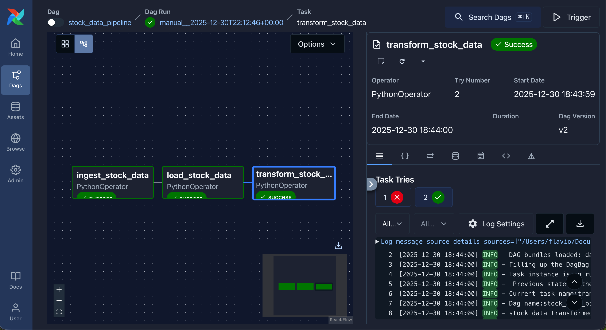
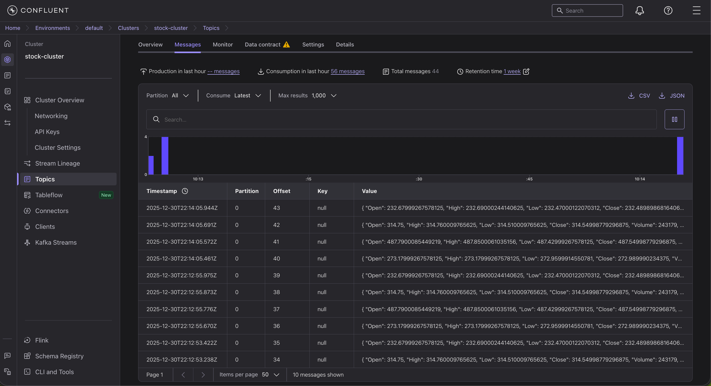
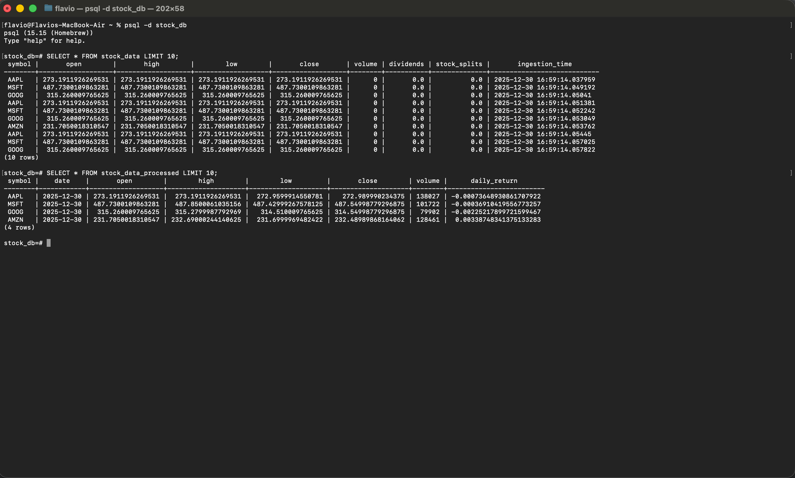

## Project Overview

This project implements an **ELT data pipeline** for stock market
data using **Apache Airflow** as the data ochestration platform and
**Apache Kafka** as the event streaming platform.

## Pipeline Structure
1. Ingest and publishes stock data to kafka topic on the cloud
2. Consumes and loads data into PostgreSQL database
3. Transforms raw data into clean, analytics-ready data

## Tech Stack
- Apache Airflow
- Apache Kafka
- Confluent Cloud
- PostgreSQL
- Python

## Screenshots
- Airflow orchestration

- Kafka streaming (Confluent Cloud)

- PostgreSQL Database

